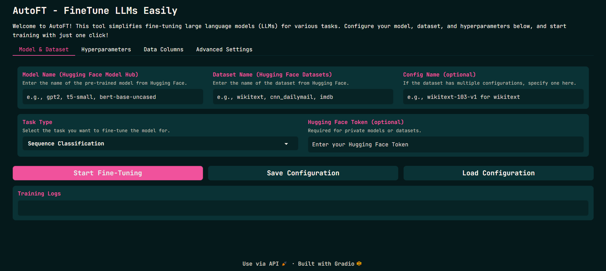
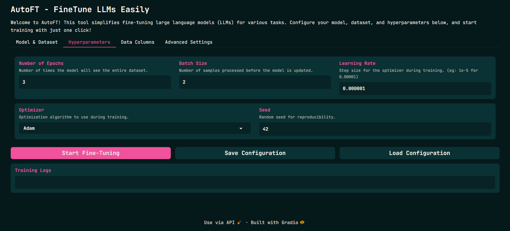
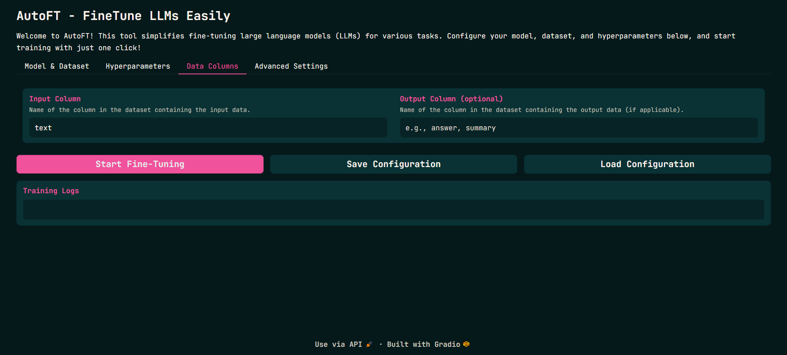
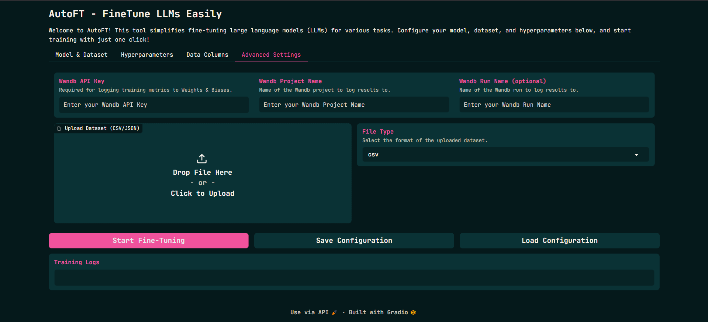

# Purpose of this:

Basically want to create a tool like AutoTrain specifically for fine-tuning LLMs.

# How would it work:

A Streamlit or Gradio interface where the user will pass a dataset and model name (both need to be present on Hugging Face). Then, the user will choose the task (classification, text generation, etc.). The user can pass in hyperparameters but can also choose to use the default hyperparameters. Logging will be done by Weights and Biases (wandb), and the user will need to pass their wandb API key.

Then, the user will click on the finetune button, and the model will be fine-tuned on the dataset with logs stored on wandb. The user can run this on their local machine or on a cloud instance by just cloning the repository, installing the dependencies, and running the main file.

# How to go ahead with this thing:

First start with just one task like text generation, as there are tons of resources available for fine-tuning LLMs for text generation. Using those resources, I can figure out the hyperparameters, and then creating a Gradio interface for that won't be that hard. Then I can move on to other tasks like classification, etc.

# How to run this:

1. **Clone the Repository**:
   ```bash
   git clone https://github.com/Vishal-Padia/AutoFT.git
   cd AutoFT
   ```

2. **Install Dependencies**:
   
   Make sure you have Python installed. Then install the required packages:
   ```bash
   pip install -r requirements.txt
   ```

3. **Set Up Weights and Biases**:
   - Create an account on [Weights & Biases](https://wandb.ai) if you don't have one.
   - Get your API key from your W&B account settings.
   - Set up your API key in your environment:
     ```bash
     export WANDB_API_KEY='your_api_key_here'
     ```
4. **Setup Up HuggingFace**:
    - Create an account on [Hugging Face](https://huggingface.co) if you don't have one.
    - Get your API key from your Hugging Face account settings.
    - Set up your API key in your environment:
      ```bash
      export HF_HOME='your_api_key_here'
      ```

5. **Run the Application**:
   Start the Gradio interface:
   ```bash
   gradio app.py
   ```

6. **Follow the Interface Instructions**:
   - Upload your dataset and specify the model name.
   - Choose your task type and configure hyperparameters.
   - Click on "Finetune" to start the process.

# What I need to do:

- [x] Create a Gradio interface
- [x] Figure out different hyperparameters for text generation
- [x] Start implementing the fine-tuning part
- [x] Figure out GPU and CPU parts
- [x] Figure out logging part
- [x] Create different files and functions for different tasks
- [ ] Write documentation
- [ ] Test code
- [ ] Add more tasks (QnA, Machine Translation, etc.)
- [ ] Research hyperparameters for different tasks
- [ ] Talk to someone who can help in hosting this on Hugging Face Spaces
- [ ] Add more features
- [x] Beautify Gradio interface
- [ ] Post on X about this project
- [ ] Post on LinkedIn about this project
- [ ] Research different types of fine-tuning (like supervised, few-shot, etc.)
- [ ] Move different tasks to a sidebar and have different tabs for different types of fine-tuning (like supervised, few-shot, etc.)
- [ ] Add features for more types of fine-tuning (like Supervised FT, Few-Shot learning, Transfer learning, etc.)
- [ ] Get someone to contribute to this project along with me
- [ ] Make this more generalized

# Here's how this looks:

Model & Dataset Tab:


Hyperparameters Tab:


Data Columns Tab:


Advance Settings Tab:



# Things I think which are difficult:

The most difficult part would be figuring out hyperparameters for different tasks. However, I think I can manage that by looking at available resources online. Also, fine-tuning LLMs requires GPUs, so I need to figure out if I can just have a toggle button for users to choose between CPU and GPU. If users choose either one of them, then I need to check if I can pass it in the code with device argument.

02-01-2025: I want to add different types of fine-tuning methods in this tool. But I don't know how all of those work. So first I'll need to understand how all those methods work before implementing them in this tool. I think I should start with supervised fine-tuning as that is the most common one. Then I can move on to other methods like few-shot learning and transfer learning. Additionally, I should add a sidebar in the Gradio interface where users can choose between different types of fine-tuning methods and corresponding tasks.

---